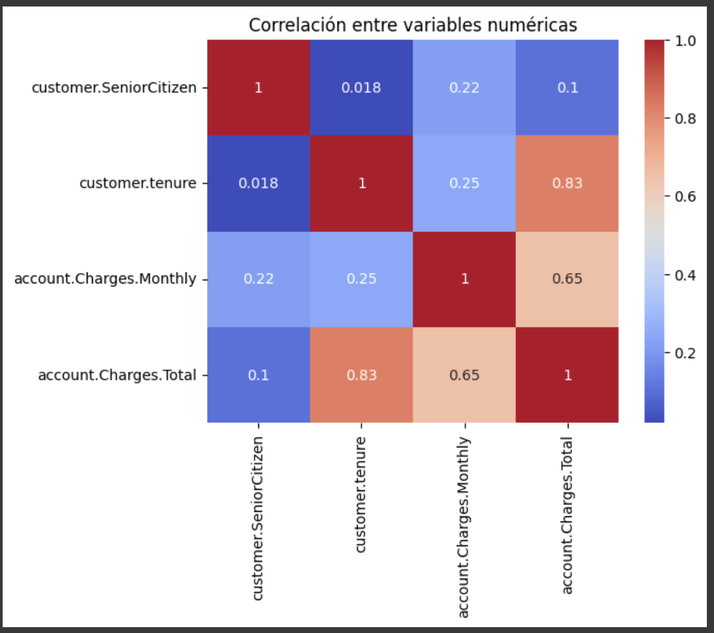

# :chart_with_downwards_trend: Análisis de Evasión de Clientes - Telecom X

Este proyecto forma parte de un desafío de análisis de datos enfocado en identificar patrones y variables asociadas a la cancelación de clientes (churn) en una empresa ficticia de telecomunicaciones llamada **Telecom X**. El objetivo es ayudar al equipo de Data Science a comprender el comportamiento de los clientes y proponer soluciones estratégicas para mejorar la retención.

## :pushpin: Objetivos del Proyecto

- 🧹 Aplicar el proceso ETL (Extracción, Transformación y Carga) sobre datos en formato JSON.
- 📊 Realizar un Análisis Exploratorio de Datos (EDA) para detectar patrones relevantes.
- 📈 Visualizar relaciones entre variables con gráficos claros y efectivos.
- 🧠 Generar insights clave que expliquen el comportamiento de cancelación de los clientes.
- 🧪 Sentar las bases para un futuro modelo predictivo de churn.

## :file_folder: Dataset

El dataset contiene información de 7,000 clientes de Telecom X, incluyendo:

- Datos demográficos (`gender`, `SeniorCitizen`, `Partner`, `Dependents`)
- Servicios contratados (`PhoneService`, `InternetService`, etc.)
- Información de cuenta (`tenure`, `MonthlyCharges`, `TotalCharges`)
- Variable objetivo: `Churn` (Yes / No)

Formato original: **JSON**

## :hammer: Tecnologías y Librerías

- `Python 3.11`
- `Pandas` para manipulación de datos
- `NumPy` para operaciones numéricas
- `Matplotlib` y `Seaborn` para visualización de datos
- `Scikit-learn` para preprocesamiento y futuros modelos

## ::bar_chart: Análisis Exploratorio (EDA)

El análisis incluye:

- Distribución de cancelaciones (`Churn`)
- Relación entre antigüedad del cliente y cancelación
- Comparación entre cargos mensuales y churn
- Impacto del número de servicios contratados
- Matriz de correlación entre variables numéricas

## :brain: Hallazgos Clave

- El **26.75% de los clientes** canceló su servicio.
- Los clientes con **poca antigüedad (`tenure`)** son más propensos a cancelar.
- Los **cargos mensuales altos** están asociados a mayor churn.
- **Más servicios contratados = menor probabilidad de cancelación**.
- El tipo de contrato y forma de pago también influyen significativamente.

## :rocket: Próximos Pasos

- Entrenamiento de modelos predictivos (Logistic Regression, Random Forest, XGBoost).
- Evaluación de métricas de clasificación (Accuracy, ROC AUC, Recall).
- Implementación de estrategias de fidelización basadas en los perfiles de riesgo.

## :woman: Autor

**Ysabel Mata**  
:link: [GitHub](https://github.com/ysabelmata) • [LinkedIn](https://www.linkedin.com/in/ysabelmata/)

